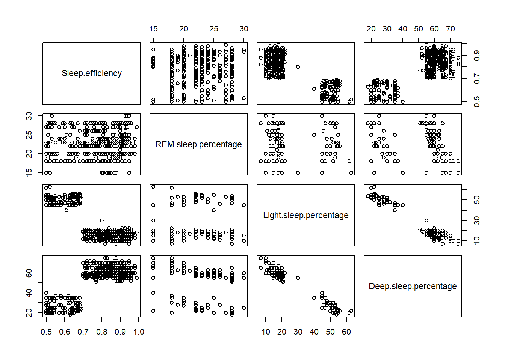

# Investigating Sleep Efficiency with Linear Regression 

This Project was completed as a gorup project for the University of Calgary course DATA603 - Statistical Modelling with Data.

## Introduction

Sleep is a fundamental biological need for humans, as highlighted in Maslow’s hierarchy of needs. However, sleep alone is not sufficient; it must be efficient. 
Sleep efficiency refers to the proportion of time spent actually sleeping while in bed. 
Understanding sleep efficiency is critical because poor sleep quality can negatively impact individuals across multiple dimensions, including cognitive, emotional, and physical health.

The primary problem this project aims to address is identifying the key factors that influence sleep efficiency and understanding how these factors interact to affect sleep quality. 

This problem is challenging because everyone’s sleep schedule and habits are different, so we might encounter barriers when trying to create a model that accurately predicts sleep efficiency for everyone. 

By identifying the factors that influence sleep efficiency, we can provide evidence-based recommendations to help individuals improve their sleep quality and, consequently, their overall quality of life.

## Dataset

The dataset was obtained from Kaggle which is free to use for project purposes. The dataset contains various factors affecting the sleep efficiency listed in different columns.

1. **Age**: The participant’s age. Sleep habits and quality might change as a person gets older.

2. **Gender**: A person’s gender. We will investigate if different genders have different patterns in sleep efficiency.

3. **Bedtime**: The time at which a person goes to bed. It is a key part of the body’s natural circadian rhythm.

4. **Wake-up time**: The time a person wakes up. This can disrupt sleep cycles if it is inconsistent or too early.

5. **Sleep duration**: The amount of time spent sleeping. Both insufficient and excessive sleep can harm sleep quality.

6. **REM sleep**: The percentage of total sleep that is REM sleep. It is crucial for cognitive restoration and emotional regulation.

7. **Deep sleep**: The percentage of total sleep that is deep sleep. This phase is essential for physical recovery and immune function.

8. **Light sleep**: The percentage of total sleep that is light sleep. While less restorative, light sleep still plays a role in transitioning between sleep stages.

9. **Awakenings**: The number of times a participant awoke during the night. Frequent awakenings during the night can fragment the sleep stages.

10. **Caffeine consumption**: Amount of caffeine consumed (mg) 24-hour before bedtime. Caffeine could keep someone awake longer than necessary and disrupt their circadian rhythm.

11. **Alcohol consumption**: Amount of alcohol consumed (oz) in the 24-hour before bedtime. Alcohol could keep someone awake longer than necessary and disrupt their circadian rhythm.

12. **Smoking status**: Whether the participant smokes or not. Nicotine is a stimulant that can interfere with falling asleep and staying asleep.

13. **Exercise frequency**: The number of times a participant exercises in a week. Regular physical activity has been shown to reduce stress and improve sleep quality.

14. **Sleep Efficiency**: This will be the response variable, is quantitative, and as stated in the project proposal is measured in percentage. Given there are no values collected as 0 or 100, and the values close to 100 represent less than 3% of the records within the dataset , we see it is viable to try to model the sleep efficiency in this project.


## Results

Our results indicate that we were able to create a multiple linear regression model to predict sleep efficiency with a variety of significant predictors from the dataset.

### Full Additive Model

```{r}
full_model = lm(Sleep.efficiency ~ Age + factor(Gender) + Sleep.duration + REM.sleep.percentage + Deep.sleep.percentage + Light.sleep.percentage + Awakenings + Caffeine.consumption + Alcohol.consumption + factor(Smoking.status) + Exercise.frequency + Bedtime_shifted + Wakeuptime_shifted, data = sleep_data)
```

Based on the plot, the full additive model appears nonlinear. This suggest the linearity assumption may be violated, and adding interactions or higher order terms might be better capture the underlying trend.


We checked their variance inflation factor (VIF) and saw a correlation between *REM.sleep.percentage*, *Deep.sleep.percentage*, and *Light.sleep.percentage*.

Therefore, we tried to check all possible models that didn’t have a correlation between the predictors.

Based on our results, the model with *REM.sleep.percentage* and *Deep.sleep.percentage* had no multicollinearity between the predictors and both predictors were significant.

Therefore, we choose the model with *REM.sleep.percentage* and *Deep.sleep.percentage*.

Our final full additive model is:

$$
\begin{aligned}
\widehat{Sleep.efficiency} &= 0.3526447 + 0.0057675
{X_{Deep.sleep.percentage}}  + 0.0072077 {X_{REM.sleep.percentage}} \\
&\quad - 0.0413003 {X_{Smoking.status(YES)}}  + 0.0007721 {X_{Age}} - 0.0319148 {X_{Awakenings}} \\
&\quad - 0.0059629 {X_{Alcohol.consumption}} + 0.0047631 {X_{Exercise.frequency}}
\end{aligned}
$$

### Full Interaction Model

```{r}
interactionmodel = lm(Sleep.efficiency ~ REM.sleep.percentage + Age + Awakenings + Exercise.frequency + factor(Smoking.status) + Alcohol.consumption + Deep.sleep.percentage + factor(Smoking.status)*Deep.sleep.percentage + Awakenings*Deep.sleep.percentage + Age*Deep.sleep.percentage + REM.sleep.percentage*Awakenings, data = sleep_data)
```

There doesn’t seem to be any obvious pattern in the residuals plot, but the data does seem to have a curve for both low and high fitted values.

### Higher-Order Models

Since we don’t want to over-fit our model or invalidate any assumptions, we decided to investigate three different promising higher order models going forward to see which one ends up meeting the most criteria.

#### Model 1

```{r}
model1 = lm(Sleep.efficiency ~ REM.sleep.percentage + Age + Awakenings + Exercise.frequency + Smoking.status + Alcohol.consumption + Deep.sleep.percentage + Smoking.status*Deep.sleep.percentage + Awakenings*Deep.sleep.percentage + Age*Deep.sleep.percentage + REM.sleep.percentage*Awakenings + I(Deep.sleep.percentage^2) + I(Deep.sleep.percentage^3) + I(Awakenings^2) + I(Awakenings^3) + I(Awakenings^4), data=sleep_data)
```


#### Model 2

```{r}
model2 = lm(Sleep.efficiency ~ REM.sleep.percentage + Age + Awakenings + Exercise.frequency + Smoking.status + Alcohol.consumption + Deep.sleep.percentage + Smoking.status*Deep.sleep.percentage + Awakenings*Deep.sleep.percentage + Age*Deep.sleep.percentage + REM.sleep.percentage*Awakenings + I(Awakenings^2) + I(Awakenings^3) + I(Awakenings^4) + I(Deep.sleep.percentage^2) + I(Deep.sleep.percentage^3) + I(Age^2), data = sleep_data)
```


#### Model 3

```{r}
model3 = lm(Sleep.efficiency~REM.sleep.percentage+Age+Awakenings+Exercise.frequency+Smoking.status+Alcohol.consumption+Deep.sleep.percentage+Smoking.status*Deep.sleep.percentage+Awakenings*Deep.sleep.percentage+Age*Deep.sleep.percentage+REM.sleep.percentage*Awakenings+I(Age^2)+I(Age^3)+I(Age^4)+I(Age^5)+I(Deep.sleep.percentage^2)+I(Deep.sleep.percentage^3)+I(Deep.sleep.percentage^4)+I(Deep.sleep.percentage^5), data=sleep_data)
```

#### Homoscedasticity Assumption

$H_{0}:$ Heteroscedasticity is not present

$H_{a}:$ Heteroscedasticity is present.

In **model 1**, by using the Breusch-Pagan test, and getting a $p_{value} = 0.03796$ which is lower than $\alpha$ , we reject the null hypothesis and conclude that our model is heteroscedastic and there is a problem with the homoscedasticity assumption.

In **model 2**, by using the Breusch-Pagan test, and getting a $p_{value} = 0.0523$ which is higher than $\alpha$ , we fail to reject the null hypothesis and conclude that our model is not heteroscedastic and there is not a problem with the homoscedasticity assumption.

In **model 3**, by using the Breusch-Pagan test, and getting a $p_{value} = 0.2247$ which is higher than $\alpha$ , we fail to reject the null hypothesis and conclude that our model is not heteroscedastic and there is not a problem with the homoscedasticity assumption.

All of these models have all significant predictors and a high $R^{2}_{adj}$ value. **Model 2** has one predictor that isn’t quite significant, but it is being kept in the model to compare for all future assumptions.

#### Linearity Assumption

Model 1:


Model 2:


Model 3:


Based on these final graphs, we can see that adding higher-order terms has improved the linearity of all the models and we can proceed with checking other assumptions.

#### Outliers Assumption

Model 1:


Model 2:


Model 3:


None of the data points for any of the models are considered outliers because they all have small Cook’s distance values. This means that there are no points with abnormally high influence on the outcome of the model and we don’t have to remove any outliers.

#### Independence Assumption

Since each row in the data is associated with a unique test subject and are not related to each other in a time-series, we can safely assume that the measurements are independent. 
If we suspected the measurements might not be independent, we could plot error terms in the order in which they occur in the dataset and try to observe any pattern in the plot.

#### Equal Variacne Assumption

$H_{0}:$ There is common variance

$H_{a}:$ There is not common variance

Model 1:


Model 2:


Model 3:


These residual and scale-location plots seem to have slight patterns, suggesting the models might have heteroscedasticity. We need to investigate further by using the Breusch-Pagan test with a null hypothesis that the models have homoscedasticity and the alternate hypothesis being that the models have heteroscedasticity.

The results from the bp-tests show that **model 1** has heteroscedasticity while **model 2** and **model 3** have homoscedasticity, with **model 3** being the best option here.

#### Normality Assumption

$H_{0}:$ the sample data are significantly normally distributed 

$H_{a}:$ the sample data are not significantly normally distributed

Model 1:


Model 2:


Model 3:


According to the stat-QQ line plot, there is a noticeable bow shaped pattern and kurtosis of the diagonal points, suggesting that the residuals are not normally distributed. 
We can also confirm this by running a Shapiro-Wilk test for normality with the null hypothesis being that the residuals are normally distributed and the the alternate hypothesis being that the residuals are not normally distributed. 
The $p_{values}$ for all models are very low, so we conclude that the residuals are not normally distributed.


### Final Model

Therefore the final model is:

$$
\begin{aligned}
\widehat{Sleep.efficiency} &= -2.308 + 0.0058 X_{REM.sleep.percentage} + 0.1067 X_{Age} + 0.0779 X_{Awakenings} + 0.0071 X_{Exercise.frequency} \\
& - 0.1514 X_{Smoking.statusYes} - 0.0062 X_{Alcohol.consumption} + 0.2858 X_{Deep.sleep.percentage} \\
& - 0.0061 X_{Age}^2 + 0.00017 X_{Age}^3 - 0.00000216 X_{Age}^4 + 0.0000000105 X_{Age}^5 \\
& - 0.0148 X_{Deep.sleep.percentage}^2 + 0.00036 X_{Deep.sleep.percentage}^3 - 0.00000412 X_{Deep.sleep.percentage}^4 + 0.0000000177 X_{Deep.sleep.percentage}^5 \\
& + 0.0022 X_{Smoking.statusYes} * X_{Deep.sleep.percentage} \\
& - 0.00099 X_{Awakenings} * X_{Deep.sleep.percentage} \\
& - 0.0000261 X_{Age} * X_{Deep.sleep.percentage} \\
& - 0.0024 X_{REM.sleep.percentage} * X_{Awakenings}
\end{aligned}
$$

Also, the sub-model for smokers:

$$
\begin{aligned}
\widehat{Sleep.efficiency} &= -2.4594 + 0.0058 X_{REM.sleep.percentage} + 0.1067 X_{Age} + 0.0779 X_{Awakenings} + 0.0071 X_{Exercise.frequency} \\
& - 0.0062 X_{Alcohol.consumption} + 0.2880 X_{Deep.sleep.percentage} \\
& - 0.0061 X_{Age}^2 + 0.00017 X_{Age}^3 - 0.00000216 X_{Age}^4 + 0.0000000105 X_{Age}^5 \\
& - 0.0148 X_{Deep.sleep.percentage}^2 + 0.00036 X_{Deep.sleep.percentage}^3 - 0.00000412 X_{Deep.sleep.percentage}^4 + 0.0000000177 X_{Deep.sleep.percentage}^5 \\
& - 0.00099 X_{Awakenings} * X_{Deep.sleep.percentage} \\
& - 0.0000261 X_{Age} * X_{Deep.sleep.percentage} \\
& - 0.0024 X_{REM.sleep.percentage} * X_{Awakenings}
\end{aligned}
$$

and the sub-model for non-smokers:

$$
\begin{aligned}
\widehat{Sleep.efficiency} &= -2.308 + 0.0058 X_{REM.sleep.percentage} + 0.1067 X_{Age} + 0.0779 X_{Awakenings} + 0.0071 X_{Exercise.frequency} \\
& - 0.0062 X_{Alcohol.consumption} + 0.2858 X_{Deep.sleep.percentage} \\
& - 0.0061 X_{Age}^2 + 0.00017 X_{Age}^3 - 0.00000216 X_{Age}^4 + 0.0000000105 X_{Age}^5 \\
& - 0.0148 X_{Deep.sleep.percentage}^2 + 0.00036 X_{Deep.sleep.percentage}^3 - 0.00000412 X_{Deep.sleep.percentage}^4 + 0.0000000177 X_{Deep.sleep.percentage}^5 \\
& - 0.00099 X_{Awakenings} * X_{Deep.sleep.percentage} \\
& - 0.0000261 X_{Age} * X_{Deep.sleep.percentage} \\
& - 0.0024 X_{REM.sleep.percentage} * X_{Awakenings}
\end{aligned}
$$


## Conclusion

The analysis conducted provides promising insights into how various lifestyle and physiological factors influence sleep efficiency, even if the model is not perfectly suited for individual-level predictions. The final model explains **85.44**% of the variance in sleep efficiency, highlighting key influences such as exercise, alcohol, smoking, age, awakenings, and deep sleep percentage.

Alcohol consumption and smoking both demonstrate negative effects on sleep efficiency, with smoking showing a particularly strong detrimental impact. These findings align with existing medical research about substance use and sleep quality. Interestingly, while smoking generally reduces sleep efficiency, the model suggests deep sleep may slightly mitigate this effect, possibly due to nicotine's temporary relaxing properties.

The relationship between age and sleep efficiency proves complex, following a **nonlinear pattern** that changes across different life stages. This likely reflects how various life circumstances and health factors influence sleep differently at various ages, rather than being solely caused by biological aging itself.

Sleep architecture plays a crucial role in sleep efficiency. *REM sleep* shows a clear positive association with better sleep quality, supporting its importance for cognitive restoration. *Deep sleep* presents a more nuanced relationship, where moderate amounts are beneficial but excessive duration may become counterproductive, indicating balance is key.

The unexpected positive association between nighttime awakenings and sleep efficiency warrants further investigation. While initially counterintuitive, this effect is likely explained by the negative offset provided by the interaction between awakenings and deep sleep percentage. Individuals who are able to achieve a large percentage of deep sleep seem to be less affected by awakenings since they can still achieve enough deep sleep. The positive interpretation of awakenings might also suggest measurement limitations in the study design.


## Refrences

* Deng, Z., Liu, L., Liu, W., Liu, R., Ma, T., Xin, Y., Xie, Y., Zhang, Y., Zhou, Y., & Tang, Y. (2024). Alterations in the fecal microbiota of methamphetamine users with bad sleep quality during abstinence. BMC Psychiatry, 24(1), 324-12. https://doi.org/10.1186/s12888-024-05773-5

* ENSIAS. (2021). Sleep Efficiency Dataset. Kaggle. Retrieved [March 11, 2025], from https://www.kaggle.com/datasets/equilibriumm/sleep-efficiency/data 

* Fjell, A. M., Sørensen, Ø., Wang, Y., Amlien, I. K., Baaré, W. F. C., Bartrés-Faz, D., Boraxbekk, C., Brandmaier, A. M., Demuth, I., Drevon, C. A., Ebmeier, K. P., Ghisletta, P., Kievit, R., Kühn, S., Madsen, K. S., Nyberg, L., Solé-Padullés, C., Vidal-Piñeiro, D., Wagner, G., . . . Walhovd, K. B. (2023). Is short sleep bad for the brain? brain structure and cognitive function in short sleepers. The Journal of Neuroscience, 43(28), 5241-5250. https://doi.org/10.1523/JNEUROSCI.2330-22.2023

* Maslow, A. H. (1943). A theory of human motivation. Psychological Review, 50(4), 370-396.

* Pan, L., Li, L., Peng, H., Fan, L., Liao, J., Wang, M., Tan, A., & Zhang, Y. (2022). Association of depressive symptoms with marital status among the middle-aged and elderly in rural china: Serial mediating effects of sleep time, pain and life satisfaction. Journal of Affective Disorders, 303, 52-57. https://doi.org/10.1016/j.jad.2022.01.111

* Wang, L., & Aton, S. J. (2022). Perspective – ultrastructural analyses reflect the effects of sleep and sleep loss on neuronal cell biology. Sleep (New York, N.Y.), 45(5), 1. https://doi.org/10.1093/sleep/zsac047
